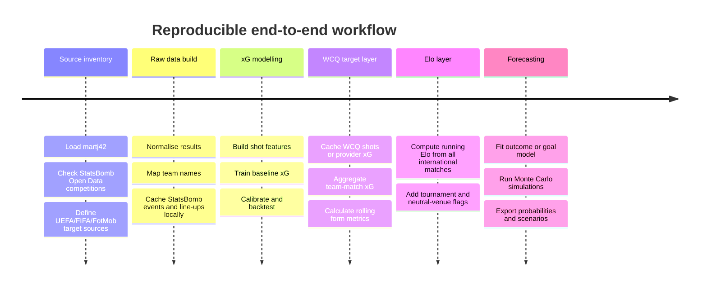

# Building a free Elo-plus-xG forecasting model for UEFA World Cup Qualifiers in R

## Executive summary

Yes, a combined **Elo + xG** predictor for the **UEFA World Cup Qualifiers** is currently realistic **without paid data feeds**, but only as a **hybrid solution**. For the results and Elo backbone, the dataset by **martj42** is strong: it covers men’s international matches from 1872 up to the present period and includes `results.csv`, `shootouts.csv`, and `goalscorers.csv`, which is exactly the kind of historical information needed for running ratings and backtests. For **freely licensed shot/event training data**, **StatsBomb Open Data** is by far the best open source. However, for **WCQ-UEFA shot data itself**, I did not find a cleanly open-licensed, documented standard source among the checked sources. In practice, almost all non-paid WCQ shot pipelines currently end at public websites such as **FotMob** or, previously, **FBref**.

The most robust architecture is therefore two-stage. The **strictly licence-clean** option is: use `martj42` for results, compute your own Elo in R, use official UEFA/FIFA pages for fixtures and line-ups, and do **not** include a WCQ shot-xG layer. The **most practically useful** option is: use `martj42` for all international results and Elo, train your own xG model on **StatsBomb Open Data**, and then add a carefully cached **FotMob research layer** for WCQ shot history or provider-side xG. **FBref** is currently no longer a reliable core source for xG: Sports Reference removed advanced data on **20 January 2026**, and the previously useful **`worldfootballR_data` repository has been archived** and is no longer maintained.

For the **own xG model**, the key point is to separate the **training source** from the **target source**. Training can be done reasonably well on open StatsBomb data. A recent reproducible study shows that using only **distance, angle, body part, and competition** can yield AUC values of around **0.75** for a pure location-based baseline and up to **0.79** for a mixed-effects model. A newer interpretable Bayesian mixed-effects study based on StatsBomb Open Data reaches **AUC 0.781** with seven variables, close to a proprietary StatsBomb benchmark of **0.801**. A 2024 PLOS ONE paper also shows that including **preceding events** before the shot can further improve performance; its multi-event model reached **AUC 0.826** on a separate test set. For a free WCQ stack, the implication is: a **minimalist, source-robust xG model** is realistic; a full state-of-the-art model with complete freeze-frame or tracking features is only partly achievable without paid feeds.

The weakest layer today is **line-ups and injuries**. **UEFA match pages** show line-ups and squad lists publicly; **FotMob** and partly **FBref** provide match-player information; **Transfermarkt** provides free injury proxies through league injury pages and player histories. However, for **national teams**, I found no clean free injury feed that reliably encodes whether a player was available or unavailable for a specific international match. Injury and availability variables should therefore be **optional** and **manually validated**, not the core of the system.

## Available data sources

The sensible priority order for a free WCQ-UEFA stack is: **results and Elo history** from `martj42`, **free xG training** from **StatsBomb Open Data**, **WCQ shots or provider xG** practically from **FotMob**, **line-ups** primarily from **UEFA match pages**, and **injuries** only as supplementary information from **Transfermarkt**. **Understat** is useful as additional training material, but it does **not** cover international matches. **FBref** has become structurally weaker for xG since January 2026.

| Source | Type | Coverage years | WCQ-UEFA | Access | Key fields | Pros / cons |
|---|---|---:|---|---|---|---|
| `martj42/international-football-results-from-1872-to-2017` | Match results, shootouts, goal scorers | 1872–2025 in Kaggle; GitHub mirror up to 2024 | **Yes**, results fully usable; goal scorers especially useful for World Cup/EURO qualifiers | Kaggle API/CLI or GitHub raw files | Date, teams, goals, tournament, city/country, neutral flag; separate shootouts/scorers | **Best free Elo backbone**; no shot/event data |
| UEFA/FIFA qualifier hubs | Official fixtures, results, match pages, line-ups | Strong for the current cycle | **Yes**, very good for current WCQ-UEFA matches | Web, manual access or careful parsing | Fixtures, results, line-ups, squad lists, match info | **Official and current**; no documented open API, no free shot coordinates |
| StatsBomb Open Data | Event-level data, line-ups, partly 360 data | Selective; includes FIFA World Cups 1958–2022, UEFA Euro 2020/2024, other tournaments/leagues | **No** | GitHub JSON or `StatsBombR` | Events, shots, locations, line-ups, partly 360 | **Best open training source**; target competition WCQ not included |
| FotMob | Match details, shot map, provider xG, match-player data | Publicly visible for WCQ-UEFA: 2012/13, 2016/17, 2021/22, 2025/26 | **Yes**, practically the most important free public WCQ shot source | Undocumented web/API endpoints, `worldfootballR`, manual cache | Shot map/shots, match details, xG, match players | **Very useful in practice**; ToS prohibits automatic/systematic use |
| FBref | Match results, shooting, line-ups, historical season pages | Historical season pages exist; advanced data/xG removed since Jan 2026 | **Historically yes**, but **unreliable for xG today** | Web / `worldfootballR` | Match URLs, results, line-ups; formerly shooting/xG | Previously very good; now limited due to data removal |
| Transfermarkt | Injuries, injury history, team/player metadata | Current league injuries plus historical player injuries | **Only indirectly** | Web / `worldfootballR` | Injury type, expected absence, player history | Best free injury proxy; not national-team specific |
| Understat | Shot-level and provider-xG data for leagues | Since 2014/15 for top leagues | **No** | `worldfootballR` / community wrappers | Shot locations, xG, league match data | Useful as extra training material; no international coverage |

The key points are: **(a)** `martj42` is excellent as the Elo backbone, **(b)** StatsBomb is the best genuine open-data training source, and **(c)** for WCQ-UEFA shots, FotMob is practically strong but legally and operationally sensitive.

The main concrete dataset and reference URLs for a reproducible start are:

```text
Kaggle martj42:
https://www.kaggle.com/datasets/martj42/international-football-results-from-1872-to-2017

GitHub mirror martj42:
https://github.com/martj42/international_results

StatsBomb Open Data:
https://github.com/statsbomb/open-data

StatsBomb competitions JSON:
https://github.com/statsbomb/open-data/blob/master/data/competitions.json

FBref WCQ-UEFA seasons:
https://fbref.com/en/comps/6/history/WCQ----UEFA-M-Seasons

FotMob WCQ-UEFA:
https://www.fotmob.com/leagues/10195/overview/world-cup-qualification-uefa

FIFA WCQ-UEFA scores & fixtures:
https://www.fifa.com/en/tournaments/mens/worldcup/canadamexicousa2026/qualifiers/uefa/scores-fixtures

UEFA European Qualifiers fixtures & results:
https://www.uefa.com/european-qualifiers/fixtures-results/

Betfair Elo tutorial in R:
https://betfair-datascientists.github.io/modelling/soccerEloTutorialR/
```

## Building your own xG from free data

The core question is not just **whether** one can compute xG oneself, but **for which part of the pipeline**. For **training**, the answer is clearly **yes**: StatsBomb Open Data provides open event data, line-ups, and for selected competitions even 360 data, which makes it possible to train reproducible xG models with reasonable quality. For **WCQ-UEFA as the target competition**, the answer is more nuanced: it is only possible if you can access **shot-level fields** such as shot location, body part, and situation. This is exactly where the gap lies, because StatsBomb does not cover WCQ, and the freely accessible WCQ shot data currently come more from public websites than from a clean open-data source.

For **training data**, three classes of sources make sense in practice. First, **StatsBomb Open Data** as the main source. Second, **Understat** as additional shot/xG material from top leagues if you want more volume; Understat covers the major European leagues, and `worldfootballR` explicitly documents Understat access for **EPL, La Liga, Bundesliga, Serie A, Ligue 1, and RFPL**. Third, **Metrica Sports Sample Data** can be useful for method experiments with event/tracking ideas, but it only contains **Sample Game 1–3**, which is too small for a general production xG model.

For the **intersection between training and target source**, I would deliberately build the model in a **minimalist** way. Robustly derivable features usually include: **shot distance**, **shot angle**, **header vs foot**, **open play vs set piece**, and a **penalty flag**. These kinds of features already go far in the literature: the reproducible StatsBomb-based work from 2026 uses distance, angle, body part, and competition and reaches around **AUC 0.75–0.79**; the 2025 Frontiers paper uses seven interpretable variables around shot type, shot location, and nearby defenders and reaches **AUC 0.781**, compared with **0.801** for the proprietary StatsBomb benchmark. The methodological point is clear: **with a robust minimal feature contract, one can build something solid for free**, even if it does not match the depth of a proprietary freeze-frame stack.

If you want **more predictive performance**, there are two sensible extensions. The first is **mixed effects / hierarchical modelling**: shooter, team, or competition random effects help account for heterogeneity without losing all interpretability. The second is **pre-shot sequence information**: the 2024 PLOS ONE paper shows that information from **one to three preceding actions** improves model performance compared with pure single-shot models and reaches **AUC 0.826** in the test set. My recommendation for a free WCQ stack is therefore: **start with logistic regression plus splines**, calibrate it, and only then move to mixed effects or sequence features.

A useful **chart idea** for the methods report would be a simple bar chart titled **“AUC by feature set”** with four groups: **location-only**, **location + body part + competition**, **interpretable mixed model**, and **multi-event model**. From the open studies, you can use the following reference anchors: roughly **0.75**, **0.79**, **0.781/0.801**, and **0.826**. This would show clearly how much extra performance is gained by adding more context, and where the benefit may no longer justify the legal and operational cost of a more difficult target source.

A deliberately **simple and robust xG training block** in R could look like this:

```r
# Minimal xG feature contract on StatsBomb coordinates (120x80)
library(dplyr)
library(purrr)
library(tidyr)
library(tidymodels)

goal_y1 <- 36.34
goal_y2 <- 43.66
goal_x  <- 120

calc_distance <- function(x, y) {
  sqrt((goal_x - x)^2 + (40 - y)^2)
}

calc_angle <- function(x, y) {
  a <- sqrt((goal_x - x)^2 + (goal_y1 - y)^2)
  b <- sqrt((goal_x - x)^2 + (goal_y2 - y)^2)
  c <- 7.32
  acos(pmax(-1, pmin(1, (a^2 + b^2 - c^2) / (2 * a * b))))
}

# sb_shots: shot table already extracted from StatsBomb events
xg_train <- sb_shots %>%
  filter(!shot_type %in% c("Penalty")) %>%
  mutate(
    distance = calc_distance(x, y),
    angle    = calc_angle(x, y),
    header   = shot_body_part == "Head",
    open_play = play_pattern == "Regular Play",
    goal = factor(if_else(shot_outcome == "Goal", "yes", "no"))
  ) %>%
  select(goal, distance, angle, header, open_play, competition)

rec <- recipe(goal ~ ., data = xg_train) %>%
  step_ns(distance, deg_free = 4) %>%
  step_ns(angle, deg_free = 4) %>%
  step_dummy(all_nominal_predictors())

mod <- logistic_reg() %>% set_engine("glm")

wf <- workflow() %>% add_recipe(rec) %>% add_model(mod)

fit_xg <- fit(wf, data = xg_train)
```

The modelling idea follows the open StatsBomb-based studies: first build an **interpretable baseline layer**, then calibrate it, and only later add sequence or mixed-effects extensions.

## Provider xG and Elo integration

If you do **not** want to compute everything yourself, **FotMob** is currently the most practically useful free public alternative. FotMob publicly shows **World Cup Qualification UEFA** cycles for **2012/2013, 2016/2017, 2021/2022, and 2025/2026**. `worldfootballR::fotmob_get_match_details()` is interesting here because the documentation says it returns a **data frame of match shots** and internally reads from the **`shotmap$shots`** structure. FotMob itself also states that match pages include **live xG**. Technically, this makes FotMob highly attractive for a WCQ target layer.

However, legally and operationally, FotMob is **not equivalent to open data**. Its public terms indicate that the use of **automatic services** such as **robots, crawlers, indexing**, or other methods of systematic/regular use is not allowed. In practice this means: for research prototypes, one can discuss small, cached, manually controlled research dumps, but **not aggressive or continuous full synchronisation**. If you want to minimise ToS risk, the cleaner workaround is to use **FotMob only as a small, manually validated add-on layer**, or to run the WCQ model without shot data and use xG only as a trained team-strength proxy from open tournament data.

**FBref** used to be the obvious free alternative, but for this purpose it is **no longer** the foundation I would build on. Sports Reference stated on **20 January 2026** that **Advanced Data** had been removed and could no longer be provided; the FBref homepage itself points to this removal. In addition, Sports Reference now clearly communicates rate limits: **FBref and Stathead requests are blocked if they exceed ten requests per minute**. `worldfootballR` still documents defaults such as `time_pause = 3` for some FBref functions, which may now be too aggressive for FBref. In short: **use FBref only opportunistically**, not as the foundation for provider xG.

For **Elo**, the situation is much better. The R package **`elo`** supports running Elo calculations, probabilities, and several comparable models. The Betfair Data Scientists tutorial gives a useful step-by-step guide for building a football Elo model in R. For this project, I would compute Elo **across all men’s international matches** from `martj42`, not only across WCQ matches, because national teams play relatively few games per year and a qualifiers-only sample would be too sparse. Then link Elo not directly to shots but to **aggregated team-match xG proxies**, such as rolling `xGF`, `xGA`, `xGD`, and shot volume.

A compact Elo block in R looks like this:

```r
library(readr)
library(dplyr)
library(elo)

results <- read_csv("data/raw/martj42/results.csv") %>%
  arrange(date)

elo_hist <- elo.run(
  score(home_score, away_score) ~
    adjust(home_team, ifelse(neutral, 0, 60)) + away_team + k(20),
  data = results
)

final_ratings <- as.data.frame(final.elos(elo_hist))
```

This is deliberately simple. In a serious backtest, you would tune `k` and the home-advantage parameter for non-neutral matches using rolling-origin validation on older cycles. The implementation logic is directly compatible with the `elo` package and the Betfair reference.

## Reproducible R pipeline

For orchestration in R, I would build the pipeline with **`targets`**, the modelling with **`tidymodels`**, and web/JSON access with **`httr2`** or, for StatsBomb Open Data, direct reads from the GitHub JSON files. `targets` is designed precisely for reproducible, incremental analytical projects; `tidymodels` bundles the standard ecosystem for recipes, splits, tuning, and evaluation; `httr2` provides robust HTTP requests, retry logic, and rate-limit handling.



A practical **`targets` skeleton** could look like this:

```r
# _targets.R
library(targets)
tar_option_set(
  packages = c(
    "dplyr", "purrr", "readr", "jsonlite", "httr2", "tidyr",
    "tidymodels", "elo", "lubridate", "stringr", "arrow"
  )
)

list(
  tar_target(intl_results, read_csv("data/raw/martj42/results.csv")),
  tar_target(sb_competitions, get_statsbomb_competitions()),
  tar_target(sb_events, get_statsbomb_training_events(sb_competitions)),
  tar_target(sb_lineups, get_statsbomb_training_lineups(sb_competitions)),
  tar_target(xg_model, train_xg_model(sb_events, sb_lineups)),
  tar_target(wcq_shot_cache, read_wcq_cached_shots("data/raw/wcq_shots/")),
  tar_target(wcq_shots_scored, score_wcq_shots(wcq_shot_cache, xg_model)),
  tar_target(team_match_xg, build_team_match_xg(wcq_shots_scored)),
  tar_target(elo_history, build_running_elo(intl_results)),
  tar_target(feature_table, join_match_features(team_match_xg, elo_history, intl_results)),
  tar_target(goal_models, fit_goal_models(feature_table)),
  tar_target(simulations, simulate_upcoming_fixtures(goal_models, feature_table, nsim = 50000))
)
```

The important point is the deliberate separation between **open training data** and a **locally cached WCQ target layer**. This cache separates the actual modelling research from fragile raw-source collection.

For the **ingestion layer**, I would read `martj42` either from a locally downloaded Kaggle zip or GitHub raw files rather than relying on package convenience functions. For StatsBomb, direct access to the JSON structure is especially attractive because the repository, competitions file, and format are openly documented. With `worldfootballR`, I would be selective: it is useful for specific endpoints, but I would not treat it as a single black box for the whole project, especially since the associated data repository has been archived.

For the **WCQ shots → team-match xG target layer**, the model logic is the same whether you use self-scored xG or provider xG: sum shots by team and match, then create **rolling form metrics**, such as **EWMA xGF**, **EWMA xGA**, **xGD**, **xG per shot**, and **shots per 90**. These variables then enter the match model together with **Elo difference**, **home/neutral flag**, **recency**, and optional **line-up/absence flags**. Because national teams have small samples, the rolling windows should not be too short — I would use something like **6 to 12 competitive matches** or an **exponential weighting** over several years. The general idea of team-level xG as an aggregated signal is supported by the literature; a 2023 PLOS paper also shows that xG can explain future success better than traditional statistics.

A pragmatic **outcome / goal model** in R starts with two separate goal regressions and a Monte Carlo simulation:

```r
# feature_table: one row per match before kickoff
home_goal_mod <- glm(
  home_goals ~ elo_diff + home_xgf_ewma + away_xga_ewma + non_neutral_home + rest_diff,
  family = poisson(),
  data = train_matches
)

away_goal_mod <- glm(
  away_goals ~ (-elo_diff) + away_xgf_ewma + home_xga_ewma + rest_diff,
  family = poisson(),
  data = train_matches
)

simulate_fixture <- function(newdata, nsim = 50000) {
  lambda_home <- predict(home_goal_mod, newdata = newdata, type = "response")
  lambda_away <- predict(away_goal_mod, newdata = newdata, type = "response")

  sims <- tibble(
    hg = rpois(nsim, lambda_home),
    ag = rpois(nsim, lambda_away)
  )

  sims %>%
    summarise(
      p_home = mean(hg > ag),
      p_draw = mean(hg == ag),
      p_away = mean(hg < ag),
      exp_home_goals = mean(hg),
      exp_away_goals = mean(ag)
    )
}
```

This is not a perfect football scoreline engine, but it is a very good **first free baseline**, because it brings together **xG strength** and **Elo strength** inside a simulation framework. If it produces too few draws or has calibration problems, the next iteration should improve **calibration and the target distribution**, rather than immediately expanding the data stack.

## Limits, legal issues, and open questions

The most important legal distinction is between **open data** and **publicly visible web data**. **StatsBomb Open Data** is explicitly made available for **research projects and genuine interest**; when publishing, StatsBomb should be credited as the source and the logo should be used. **FotMob**, by contrast, explicitly prohibits **automatic services** and systematic use. **Sports Reference / FBref** also clearly rate-limits scraping and blocks FBref access above **ten requests per minute**. For a clean research stack, this means: **StatsBomb and martj42 are less problematic**, while **FotMob / FBref / Transfermarkt / Understat should be used cautiously**, with minimal requests, local caching, and no redistribution of raw data. The assessment of Transfermarkt and Understat here is deliberately cautious: I did not find a clear open-data licence for them in the checked material, only package- and wrapper-based access to public websites.

Technically, the **data-quality risks** are manageable but real. `martj42` is strong for results, but team names and political naming conventions need harmonisation. International sources may vary between names such as **Türkiye/Turkey**, **North Macedonia/Macedonia**, or other language and spelling variants. Public scraper wrappers are also vulnerable to endpoint and HTML changes; `worldfootballR`’s changelog shows exactly this through multiple bug fixes for FotMob endpoints, FBref tables, and international matches. Production logic should therefore always use a **local cache**, **file versioning**, **schema checks**, and **test fixtures**.

Conceptually, the largest unresolved issue is the **target-source question for WCQ shots**. For a fully open, long-term legally robust WCQ-UEFA xG system, I did not find a genuine free shot API or open-licensed event archive. Therefore, there are essentially three honest operating modes:

1. **Open mode**: StatsBomb trains the xG model, Elo runs on `martj42`, and WCQ is forecast using Elo plus result-based proxies only.
2. **Hybrid mode**: Add small, manually validated WCQ provider data.
3. **Experimental mode**: Cache a larger public target archive, accepting higher ToS and maintenance risks.

For serious reproducibility in 2026, I would recommend **hybrid mode**.

Several open questions remain. First: **how much WCQ shot history** can you realistically collect within your legal and operational constraints? Second: do you want to model **line-ups and injuries** at all, even though this is the least clean layer in the national-team context? Third: is a **minimal interpretable xG** with robust sourcing enough, or do you want to deliberately pursue more AUC at the cost of more fragile target sources? The good news is that you do not need to decide all of this upfront. With a modular `targets` pipeline, you can first build a stable Elo-plus-minimal-xG baseline and add further layers later.

## Short takeaway

Elo is easy and robust for internationals; xG training is feasible with StatsBomb Open Data; the bottleneck is open WCQ shot data. For a serious free-data project, start with an Elo + goal-proxy baseline, then add a carefully cached FotMob layer only as an optional research extension.
